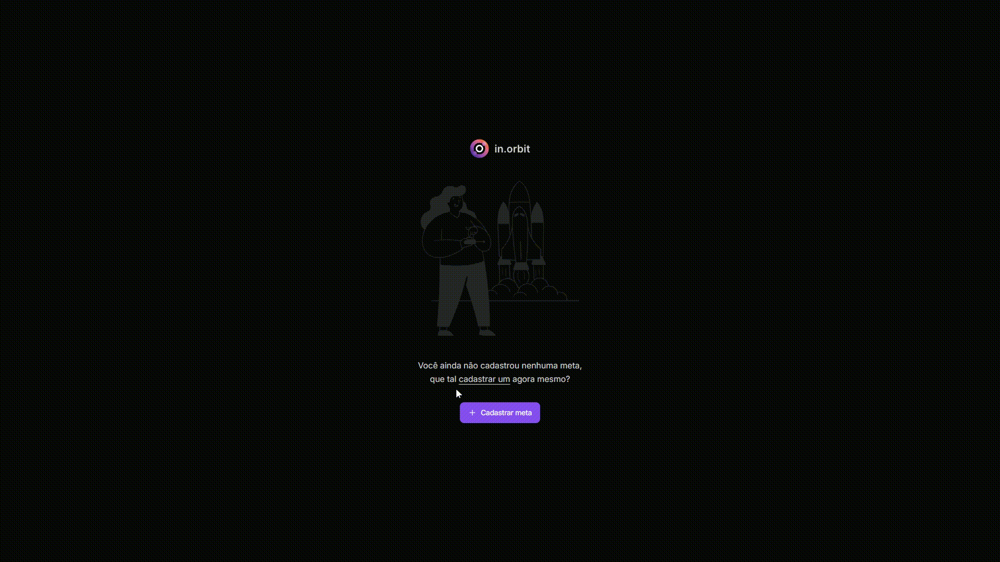

# in.Orbit

**in.Orbit** is a habit-tracking application designed to help users set, manage, and track their goals. It provides a user-friendly interface for creating goals, marking them as completed, and viewing progress over time. The project consists of three main components: a **client** (frontend), a **server** (backend), and a **CLI tool** for managing goals.

<br>




<br>

## Table of Contents

- [Features](#features)
- [Project Structure](#project-structure)
- [Installation](#installation)
- [Usage](#usage)
  - [Running the Client](#running-the-client)
  - [Running the Server](#running-the-server)
  - [Using the CLI](#using-the-cli)
- [API Endpoints](#api-endpoints)
- [Technologies Used](#technologies-used)
- [License](#license)

---

<br>

## Features

- **Goal Management**: Create, list, delete, and track goals.
- **Progress Tracking**: View weekly summaries of completed and pending goals.
- **Responsive UI**: Built with React and TailwindCSS for a modern and responsive design.
- **CLI Tool**: Manage goals directly from the terminal.
- **Backend API**: Fastify-based server with PostgreSQL database integration.

<br>

## Project Structure

```
inorbit/
├── client/                # Frontend application
│   ├── src/               # React components and services
│   ├── public/            # Static assets
│   ├── index.html         # Entry point for the client
│   └── package.json       # Client dependencies and scripts
├── server/                # Backend application
│   ├── src/               # Fastify server and database logic
│   ├── .migrations/       # Database migration files
│   ├── docker-compose.yml # PostgreSQL setup
│   └── package.json       # Server dependencies and scripts
├── inorbit-cli/           # Command-line interface tool
│   ├── index.js           # CLI logic
│   └── package.json       # CLI dependencies
├── LICENSE                # License file
└── README.md              # Project documentation
```

<br>

## Installation

### Prerequisites

- [Node.js](https://nodejs.org/) (v18 or higher)
- [Docker](https://www.docker.com/) (for running the PostgreSQL database)

### Steps

1. Clone the repository:
   ```bash
   git clone https://github.com/gusvsconcelos/inorbit.git
   cd inorbit
   ```

2. Install dependencies for all components:
   ```bash
   # Install dependencies for the client
   cd client
   npm install

   # Install dependencies for the server
   cd ../server
   npm install

   # Install dependencies for the CLI
   cd ../inorbit-cli
   npm install
   ```

3. Set up the database:
   - Start the PostgreSQL database using Docker:
     ```bash
     cd ../server
     docker-compose up -d
     ```
   - Run database migrations:
     ```bash
     npx drizzle-kit generate
     npx drizzle-kit migrate
     ```

<br>

## Usage

### Running the Client

1. Navigate to the `client` directory:
   ```bash
   cd client
   ```

2. Start the development server:
   ```bash
   npm run dev
   ```

3. Open the application in your browser at [http://localhost:5173](http://localhost:5173).

### Running the Server

1. Navigate to the `server` directory:
   ```bash
   cd server
   ```

2. Start the server:
   ```bash
   npm run dev
   ```

3. The server will be available at [http://localhost:3333](http://localhost:3333).

### Using the CLI

1. Navigate to the inorbit-cli directory:
   ```bash
   cd inorbit-cli
   ```

2. Run the CLI tool:
   ```bash
   node index.js
   ```

3. Follow the interactive prompts to manage your goals.

<br>

## API Endpoints

The server exposes the following API endpoints:

### `POST /goals`
- **Description**: Create a new goal.
- **Request Body**:
  ```json
  {
    "title": "Exercise",
    "desiredWeeklyFrequency": 3
  }
  ```

### `GET /summary`
- **Description**: Get a weekly summary of completed and pending goals.

### `GET /pending-goals`
- **Description**: Retrieve a list of pending goals.

### `POST /completions`
- **Description**: Mark a goal as completed.
- **Request Body**:
  ```json
  {
    "goalId": "goal-id"
  }
  ```

<br>

## Technologies Used

### Client
- **React**: Frontend library for building user interfaces.
- **TailwindCSS**: Utility-first CSS framework.
- **React Query**: Data fetching and state management.

### Server
- **Fastify**: High-performance web framework.
- **Drizzle ORM**: Type-safe database ORM.
- **PostgreSQL**: Relational database.

### CLI
- **Inquirer.js**: Interactive CLI prompts.

## License

This project is licensed under the MIT License.
